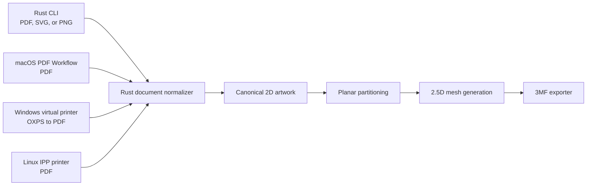

# Plaque3MF Architecture and Platform Integration Plan

**Status:** Proposed  
**Primary implementation language:** Rust  
**Canonical print-job format:** PDF

## Overview

Plaque3MF converts printed page artwork into a multi-part, printable 3MF model. The proposed design keeps approximately 90–95% of the implementation in Rust and uses small native shells for operating-system integration.

| Component | Language |
| --- | --- |
| Shared generator and CLI | Rust |
| macOS integration | Swift with a Rust static library |
| Windows integration | C# with a Rust dynamic library |
| Linux integration | Thin C/PAPPL layer with Rust, with a possible future Rust IPP server |
| Authored C++ | None, ideally |

PDF is the common input format across platforms. Document normalization, geometry, mesh generation, validation, and 3MF export remain in the shared Rust engine.



## Goals

- Provide one deterministic document-to-3MF engine across all supported platforms.
- Produce aligned, separately selectable substrate and inlay parts.
- Generate watertight meshes without relying on general-purpose 3D Boolean operations.
- Keep platform-specific code limited to print integration, UI, permissions, and file handling.
- Start with a reliable raster-first pipeline and leave room for later vector extraction.
- Validate standards compliance and practical slicer compatibility in automated tests.

## Initial non-goals

- Recovering semantic document structure such as Unicode text, paragraphs, or application objects.
- Mapping gradients, transparency, or arbitrary colors to materials.
- Automatically assigning vendor-specific extruders or filaments.
- Supporting general 3D constructive solid geometry.
- Using 3MF Boolean, Volumetric, or Slice extensions.
- Providing a literal printer-list entry on macOS in the first release.

## Shared Rust architecture

The Rust workspace should separate document processing, geometry, export, and platform boundaries:

| Crate | Responsibility |
| --- | --- |
| `job-spec` | Versioned settings schema, defaults, and validation |
| `document` | PDF, SVG, and raster normalization |
| `planar` | Contours, unions, differences, offsets, and partitioning |
| `mesh25d` | Extrusion and watertight mesh construction |
| `export-3mf` | 3MF serialization and package creation |
| `engine` | End-to-end pipeline orchestration |
| `ffi` | Narrow C-compatible interface for native shells |
| `cli` | Command-line parsing and local file handling |

Three central domain types should remain independent of operating-system APIs and third-party library types:

```text
JobSpec
CanonicalArtwork
PartModel { substrate, fill_parts }
```

Platform shells should know nothing about polygon operations, mesh construction, or 3MF internals. Each shell supplies an input document, versioned settings, and an output location.

### FFI boundary

Expose a coarse operation instead of Rust data structures:

```text
generate_3mf(
    input_pdf_path,
    output_3mf_path,
    versioned_options_json
) -> result/error
```

The implementation should:

- Build a Rust static library for macOS.
- Build a Rust `cdylib` for Windows.
- Return stable error codes plus a diagnostic message.
- Keep ownership and allocation on one side of the FFI boundary wherever possible.
- Let native shells own dialogs, permissions, temporary files, cancellation, and final file copying.

## Geometry model

Plaque3MF is a 2.5D modeling problem. All partitioning can happen in two dimensions before the resulting regions are extruded; general 3D Boolean operations are unnecessary.

Let:

- `F` be the overall footprint.
- `S` be the union of the generated border and printed foreground.
- `b` be the backing thickness.
- `t` be the total thickness.

Construct the parts as follows:

```text
substrate = F extruded from z=0..b
          + S extruded from z=b..t

fill = each connected component of (F - S)
       extruded from z=b..t
```

This construction produces:

- One substrate object containing the backing, border, and writing.
- One or more positive inlay objects occupying the remaining upper volume.
- A flat finished surface at `z=t`.
- No negative or CSG objects in the exported 3MF.

`S` and `F - S` must be produced from the same planar partition so that shared boundaries use identical coordinates. Computing them independently risks small gaps or overlaps after slicing.

Use fixed-point integer coordinates internally. Micrometres stored as `i64` provide convenient precision and deterministic geometry. Convert coordinates to millimetres only during 3MF serialization.

### Candidate geometry libraries

- [`i_overlay`](https://docs.rs/i_overlay/latest/i_overlay/) for integer polygon unions and differences.
- [`lyon`](https://docs.rs/lyon/latest/lyon/) for paths and curve flattening.
- [`Spade`](https://docs.rs/spade/latest/spade/) or another constrained triangulator for caps.
- Custom extrusion code for vertical walls.

A general 3D CSG dependency should be introduced only if the product expands beyond extruded geometry.

## Document ingestion

A print job describes page appearance, not semantic document content. The engine cannot assume that text, fonts, paragraphs, or source-application objects can be recovered reliably.

### P0 raster-first pipeline

1. Render one PDF page to grayscale at a resolution based on the physical target, initially around `0.025–0.05 mm/pixel`.
2. Composite transparency against white.
3. Threshold the image into foreground and background.
4. Remove features smaller than the configured printable minimum.
5. Trace the binary mask into closed contours.
6. Generate the border separately and union it with the foreground.

This pipeline handles text, paths, clipping, embedded fonts, and ordinary application output consistently. Vector extraction can be added later as an optimization.

[`pdfium-render`](https://github.com/ajrcarey/pdfium-render) is a practical Rust interface for consistent cross-platform PDF rendering. It binds to PDFium, which is implemented in C++, but that remains a packaged dependency rather than maintained application code. Native renderers such as Core Graphics and Windows XPS APIs are alternatives, though their output may differ subtly by platform.

The initial conversion rule should be intentionally strict: non-white page content becomes substrate. Images, gradients, transparency-driven materials, and color-to-material mapping remain out of scope for P0.

## 3MF output

The exporter should create:

- One leaf mesh named `substrate`.
- One leaf mesh for each fill region or fill material.
- One parent components object referencing every leaf mesh.
- One build item referencing the parent assembly.
- Stable part names and optional display colors or material properties.

The parent assembly preserves alignment while allowing slicers to expose the leaf parts separately. The [3MF Core specification](https://github.com/3MFConsortium/spec_core/blob/master/3MF%20Core%20Specification.md) defines component composition and build items for this purpose.

Generate baked triangle meshes using only the 3MF Core format initially. Generic 3MF display colors do not guarantee automatic extruder assignment, so separate named parts are the interoperability mechanism. Users should expect to map parts to filaments in their slicer. Bambu Studio, PrusaSlicer, Cura, or other vendor-specific project metadata can be added through optional exporters later.

### Serialization options

Two reasonable implementations are:

1. Pure Rust output through a pinned library such as `lib3mf-core`, hidden behind the project's own exporter interface.
2. The Consortium's [official lib3mf](https://github.com/3MFConsortium/lib3mf) through its C API.

Begin with pure Rust output. In CI, load every generated fixture through official lib3mf and test representative files in at least two target slicers.

## Platform delivery plan

### P0: Rust CLI

Build and validate the shared engine through a CLI before starting native integrations.

```shell
plaque3mf input.pdf \
  --width 100mm \
  --backing 1.2mm \
  --total-thickness 2.0mm \
  --border 2mm \
  --output result.3mf
```

The internal settings schema should be more complete than the initial visible CLI. Expected fields include:

- Target width and height constraints.
- Backing and total thickness.
- Border width.
- Foreground inversion.
- Raster threshold.
- Minimum feature width.
- Contour tolerance.

### P1: macOS

Use a signed Swift companion app installed as a PDF Workflow or Print Plugin rather than a traditional macOS printer driver. The user launches it from the Print dialog's PDF menu, and macOS supplies the generated PDF. Apple documents Print Plugins as an Automator workflow type in its [Automator workflow guide](https://support.apple.com/guide/automator/create-a-workflow-aut7cac58839/mac).

The Swift shell should:

1. Receive the spool PDF.
2. Display a compact dimensions and settings window.
3. Display an `NSSavePanel`.
4. Invoke the Rust static library.
5. Save the generated 3MF.

This approach receives ideal PDF input and avoids deprecated CUPS driver mechanisms and their sandbox constraints. Its main tradeoff is discoverability: the workflow appears under **Print → PDF → Create 3MF**, not in the printer list. If a literal printer entry becomes essential, a local IPP Printer Application can be evaluated later, although per-job Save As interaction would be more difficult.

### P2: Windows

Target Windows 11 version 24H2, build 26100, or newer and use Microsoft's Print Support App virtual-printer architecture. `PrintWorkflowVirtualPrinterSession` was introduced in build 26100 according to the [Microsoft API requirements](https://learn.microsoft.com/en-us/uwp/api/windows.graphics.printing.workflow.printworkflowvirtualprintersession?view=winrt-26100).

Use:

- A thin C#/WinRT MSIX application.
- `OutputFileTypes="3mf"` so the Windows Print System supplies a Save As dialog.
- OXPS as the preferred input format.
- The Windows print workflow XPS-to-PDF converter.
- The shared Rust DLL for PDF-to-3MF generation.

Microsoft documents the virtual-printer manifest and Save As behavior in the [Print Support App v4 design guide](https://learn.microsoft.com/en-us/windows-hardware/drivers/devapps/print-support-app-v4-design-guide). The [`XpsToPdf` workflow conversion](https://learn.microsoft.com/en-us/uwp/api/windows.graphics.printing.workflow.printworkflowpdlconversiontype?view=winrt-26100) is available through the print workflow APIs.

Pure Rust WinRT is possible, but C# reduces implementation risk around background activation, MSIX packaging, print tickets, and brokered files.

### P2: Linux

Create a local IPP Printer Application that advertises PDF support and passes incoming jobs to the Rust engine.

The lowest-risk initial implementation uses:

- PAPPL's C API for IPP, discovery, and job lifecycle.
- A small C callback that invokes the Rust library.
- A configured output directory or job inbox.

PAPPL is designed for modern IPP Printer Applications. OpenPrinting has deprecated traditional CUPS PPD/filter/backend drivers and recommends Printer Applications as their replacement; see [Printer Applications and Printer Drivers](https://openprinting.github.io/cups/drivers.html).

A background Linux printer service normally cannot present a client-side Save As dialog. The product therefore needs either an output-directory preference or a companion UI that receives completed jobs.

## Validation and release gates

Every release should verify the following invariants:

- Every mesh is watertight and consistently oriented.
- Every manifold edge belongs to exactly two triangles.
- Fill and substrate volumes do not overlap.
- The combined volume equals `footprint area × total thickness`, within a documented numerical tolerance.
- Shared substrate/fill boundaries contain identical coordinates.
- Generated parts remain aligned and separately selectable in supported slicers.
- Generated 3MF packages load successfully through official lib3mf.
- Golden document fixtures produce deterministic output.

Testing should include:

- Unit tests for settings, fixed-point conversions, contour cleanup, triangulation, and extrusion.
- Property tests for planar partition and mesh invariants.
- Golden tests for representative PDF inputs.
- Cross-platform rendering comparisons.
- Compatibility checks in at least two target slicers.
- End-to-end tests for each native shell as it is introduced.

## Key risks and mitigations

| Risk | Mitigation |
| --- | --- |
| Tiny gaps or overlaps between parts | Derive both sides from one fixed-point planar partition |
| Unprintable strokes or islands | Enforce configurable minimum feature size before tracing |
| Different page rendering across platforms | Bundle one pinned PDFium version where licensing and packaging permit |
| Invalid or slicer-specific 3MF behavior | Validate with official lib3mf and multiple slicers in CI |
| Users expect automatic filament mapping | Preserve named component parts and document slicer assignment |
| Native print APIs increase delivery risk | Complete and stabilize the Rust CLI before platform shells |
| Background services cannot show Save As dialogs | Use OS-native file-printer support where available; otherwise use an inbox or companion UI |

## Recommended implementation sequence

1. Define and version `JobSpec`.
2. Implement one-page PDF rendering and binary foreground extraction.
3. Implement fixed-point contour tracing and planar partitioning.
4. Implement watertight 2.5D extrusion and invariant checks.
5. Implement Core-only 3MF assembly export.
6. Ship and test the Rust CLI.
7. Add the macOS PDF Workflow.
8. Add Windows and Linux integrations independently once the engine ABI is stable.
9. Add optional vector ingestion and vendor-specific exporters only after the core pipeline is reliable.

## Architectural conclusion

Rust owns the difficult, reusable parts of Plaque3MF: document normalization, planar geometry, meshing, validation, and 3MF generation. Swift, C#, and a small amount of C connect that engine to each operating system. This division provides a consistent output model while keeping platform-specific integration narrow and replaceable.
